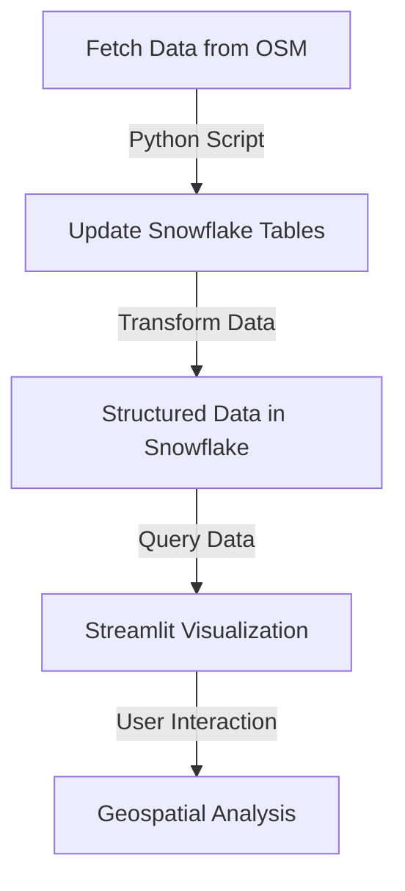

# Geospatial Pharmacy Visualization with Snowflake & Streamlit

## 📌 Overview
This project automates the retrieval, storage, and visualization of pharmacy locations using OpenStreetMap (OSM), Snowflake, and Streamlit. The pipeline consists of:

1. **Scheduled Python Script**: Fetches pharmacy data from OSM Overpass API and updates Snowflake. The script is scheduled to run using GitHub Actions.
2. **Snowflake Data Processing**: Stores and transforms raw data into a structured format.
3. **Streamlit Dashboard**: Visualizes geospatial data with buffers, hexagons (H3), and heatmaps. The Streamlit app is deployed directly inside Snowflake.

---

## 🚀 Features
- **Automated Data Retrieval**: Scheduled Python script fetches the latest data from OSM.
- **Snowflake Integration**: Data is stored, processed, and structured in Snowflake.
- **Interactive Map Visualizations**:
  - **Buffer Zones**: Circular regions around pharmacies.
  - **H3 Hexagons**: Aggregated geospatial clustering.
  - **Heatmap**: Density visualization of pharmacy locations.
  - **Search & Controls**: Name search, basemap selection, buffer radius, and hex resolution adjustments.

---

## 📂 Project Structure
```
📁 project-root/
│-- 📂 .github/workflows/  
│  │-- api-scheduler.yml # GitHub Actions for automation
│-- snowflake_sql  # SQL scripts for Snowflake table creation & transformation
│-- snowflake_streamlit  # Streamlit app for geospatial visualization
│-- script.py  # Python script for scheduled OSM data retrieval
│-- requirements.txt  # Dependencies for the project
│-- README.md  # Project documentation
```

---

## ⚙️ Setup & Installation
### 1️⃣ Clone the Repository
```bash
git clone https://github.com/rramadhani015/geospatial-analysis-pharmacy-store.git
cd your-repo
```

### 2️⃣ Install Dependencies
install the requirements inside requirements.txt

### 3️⃣ Set Up Snowflake Connection
Configure your `.env` file with your Snowflake credentials:
```
SNOWFLAKE_ACCOUNT=your_account
SNOWFLAKE_USER=your_user
SNOWFLAKE_PASSWORD=your_password
SNOWFLAKE_DATABASE=your_database
SNOWFLAKE_WAREHOUSE=your_warehouse
```

### 4️⃣ Run the Scheduled Python Script (Data Ingestion)
run script.py from your favorite scheduler (e.g. Github Action)

### 5️⃣ Execute SQL Queries in Snowflake
Run the SQL scripts inside `snowflake_sql` to create tables and transform data.

### 6️⃣ Launch the Streamlit App
run `snowflake_streamlit` inside Snowflake

---

## 📊 Data Flow


---

## 📜 License
MIT License. See `LICENSE` for details.

